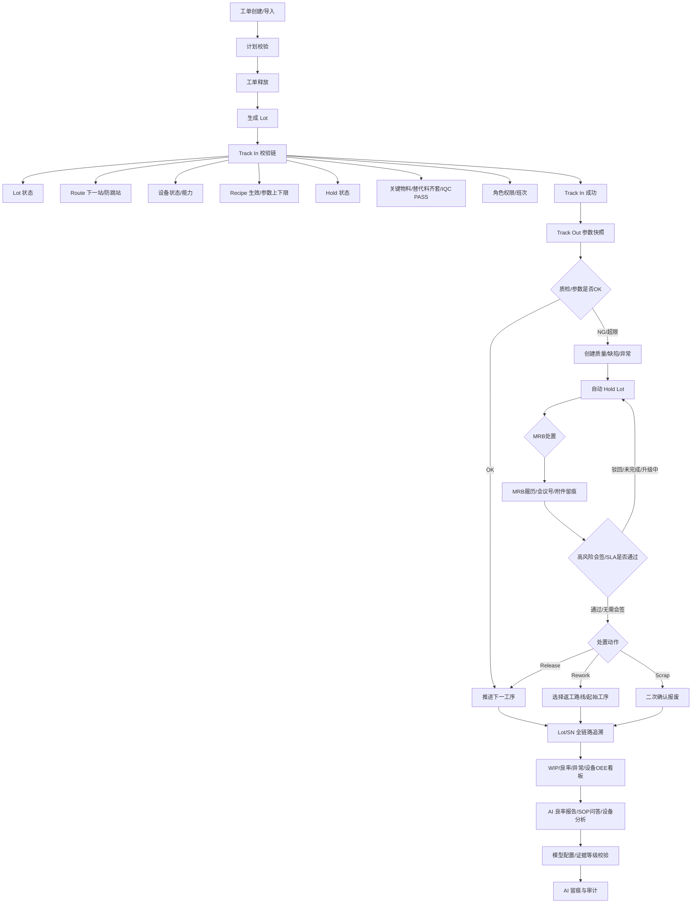
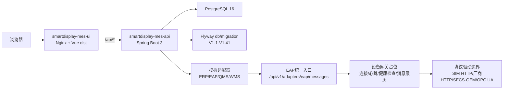

# SmartDisplay MES 流程图与ER图

## 业务闭环流程

```mermaid
flowchart TD
    A["工单创建/导入"] --> B["计划校验"]
    B --> C["工单释放"]
    C --> D["生成 Lot"]
    D --> E["Track In 校验链"]
    E --> E1["Lot 状态"]
    E --> E2["Route 下一站/防跳站"]
    E --> E3["设备状态/能力"]
    E --> E4["Recipe 生效/参数上下限"]
    E --> E5["Hold 状态"]
    E --> E6["关键物料/替代料齐套/IQC PASS"]
    E --> E7["角色权限/班次"]
    E --> F["Track In 成功"]
    F --> G["Track Out 参数快照"]
    G --> H{"质检/参数是否OK"}
    H -- "OK" --> I["推进下一工序"]
    H -- "NG/超限" --> J["创建质量/缺陷/异常"]
    J --> K["自动 Hold Lot"]
    K --> L{"MRB处置"}
    L --> L1["MRB履历/会议号/附件留痕"]
    L1 --> L2{"高风险会签/SLA是否通过"}
    L2 -- "通过/无需会签" --> I1{"处置动作"}
    L2 -- "驳回/未完成/升级中" --> K
    I1 -- "Release" --> I
    I1 -- "Rework" --> M["选择返工路线/起始工序"]
    I1 -- "Scrap" --> N["二次确认报废"]
    I --> O["Lot/SN 全链路追溯"]
    M --> O
    N --> O
    O --> P["WIP/良率/异常/设备OEE看板"]
    P --> Q["AI 良率报告/SOP问答/设备分析"]
    Q --> Q1["模型配置/证据等级校验"]
    Q1 --> R["AI 留痕与审计"]
```

## 系统部署视图

```mermaid
flowchart LR
    U["浏览器"] --> FE["smartdisplay-mes-ui<br/>Nginx + Vue dist"]
    FE -- "/api/*" --> API["smartdisplay-mes-api<br/>Spring Boot 3"]
    API --> PG["PostgreSQL 16"]
    API --> FW["Flyway db/migration<br/>V1.1-V1.41"]
    API --> ADP["模拟适配器<br/>ERP/EAP/QMS/WMS"]
    ADP --> EAP["EAP统一入口<br/>/api/v1/adapters/eap/messages"]
    EAP --> GW["设备网关占位<br/>连接/心跳/健康检查/消息履历"]
    GW --> DRV["协议驱动边界<br/>SIM HTTP/厂商HTTP/SECS-GEM/OPC UA"]
```

## 核心ER图

```mermaid
erDiagram
    PROD_ORDER ||--o{ PROD_LOT : releases
    PROD_LOT ||--o{ PROD_LOT_STEP_RECORD : records
    PROD_LOT ||--o{ LOT_HOLD_RECORD : holds
    PROD_LOT ||--o{ QUALITY_INSPECTION : inspects
    QUALITY_INSPECTION ||--o{ QUALITY_DEFECT_RECORD : defects
    PROD_LOT ||--o{ EXCEPTION_EVENT : triggers
    EXCEPTION_EVENT ||--o{ QUALITY_MRB_RECORD : reviews
    QUALITY_MRB_RECORD ||--o{ QUALITY_MRB_ATTACHMENT : attachments
    QUALITY_MRB_RECORD ||--o{ QUALITY_MRB_APPROVAL_TASK : approvals
    QUALITY_MRB_RECORD ||--o{ QUALITY_MRB_MINUTES : minutes
    PROD_LOT ||--o{ MATERIAL_CONSUMPTION : consumes
    MD_EQUIPMENT ||--o{ EQUIPMENT_EVENT : raises
    MD_EQUIPMENT ||--o{ EQUIPMENT_PARAMETER_SAMPLE : samples
    MD_EQUIPMENT ||--o{ EQUIPMENT_PM_TASK : maintains
    MD_EQUIPMENT ||--o{ EQUIPMENT_RECIPE_COMMAND : downloads
    MD_EQUIPMENT ||--o{ EQUIPMENT_STATUS_HISTORY : changes
    MD_EQUIPMENT ||--o{ EQUIPMENT_CYCLE_SAMPLE : cycles
    MD_EQUIPMENT ||--o{ EQUIPMENT_STANDARD_CYCLE : standardizes
    MD_EQUIPMENT ||--o{ EQUIPMENT_GATEWAY_MESSAGE : reports
    EQUIPMENT_GATEWAY_CONNECTION ||--o{ EQUIPMENT_GATEWAY_MESSAGE : receives
    EQUIPMENT_GATEWAY_CONNECTION ||--o{ EQUIPMENT_GATEWAY_HEALTH_CHECK : checks
    MD_ROUTE ||--o{ MD_ROUTE_STEP : contains
    MD_RECIPE ||--o{ MD_RECIPE_PARAM : defines
    MD_BOM ||--o{ MD_BOM_ITEM : contains
    MD_BOM ||--o{ MD_BOM_CHANGE_REQUEST : target_of
    MD_BOM_CHANGE_REQUEST ||--o{ MD_BOM_CHANGE_ATTACHMENT : attachments
    MD_MATERIAL_LOCATION ||--o{ MATERIAL_BATCH : stores
    MD_MATERIAL_LOCATION ||--o{ MATERIAL_LOCATION_TASK : tasks
    MD_SUPPLIER ||--o{ MATERIAL_BATCH : supplies
    MD_SUPPLIER ||--o{ SUPPLIER_CORRECTIVE_ACTION : actions
    MD_SUPPLIER ||--o{ SUPPLIER_QUALIFICATION_REVIEW_TASK : reviews
    MATERIAL_BATCH ||--o{ MATERIAL_CONSUMPTION : consumed_by
    MATERIAL_BATCH ||--o{ MATERIAL_INVENTORY_TXN : stock_txn
    MATERIAL_BATCH ||--o{ MATERIAL_LOCATION_TASK : location_task
    MATERIAL_BATCH ||--o{ MATERIAL_INCOMING_INSPECTION : iqc
    MATERIAL_INCOMING_INSPECTION ||--o{ MATERIAL_COA_ATTACHMENT : attachments
    SYS_USER ||--o{ SYS_AUDIT_LOG : operates
    AI_MODEL_CONFIG ||--o{ AI_REPORT_RECORD : configures
    AI_KB_DOCUMENT ||--o{ AI_KB_CHUNK : chunks
    AI_REPORT_RECORD ||--o{ SYS_AUDIT_LOG : audited_by

    PROD_ORDER {
        bigint id PK
        varchar order_no UK
        varchar product_code
        int planned_qty
        varchar status
    }
    PROD_LOT {
        bigint id PK
        varchar lot_no UK
        varchar order_no
        varchar current_step_code
        varchar status
        smallint hold_flag
    }
    PROD_LOT_STEP_RECORD {
        bigint id PK
        varchar lot_no
        varchar step_code
        varchar equipment_code
        varchar recipe_code
        text process_params
        varchar result
    }
    MD_ROUTE {
        bigint id PK
        varchar route_code UK
        varchar product_code
        varchar status
    }
    MD_RECIPE {
        bigint id PK
        varchar recipe_code UK
        varchar product_code
        varchar step_code
        varchar equipment_code
        varchar status
    }
    MD_BOM {
        bigint id PK
        varchar bom_code UK
        varchar product_code
        varchar bom_version
        varchar status
    }
    MD_BOM_CHANGE_REQUEST {
        bigint id PK
        varchar change_no UK
        varchar product_code
        varchar target_bom_code
        varchar status
    }
    MD_BOM_CHANGE_ATTACHMENT {
        bigint id PK
        varchar attachment_no UK
        varchar change_no FK
        varchar file_name
        varchar attachment_role
    }
    MD_MATERIAL_LOCATION {
        bigint id PK
        varchar location_code UK
        varchar storage_type
        varchar material_class
        decimal capacity_qty
        decimal used_qty
        varchar status
    }
    MATERIAL_BATCH {
        bigint id PK
        varchar batch_no UK
        varchar material_code
        decimal available_qty
        decimal frozen_qty
    }
    MATERIAL_INVENTORY_TXN {
        bigint id PK
        varchar txn_no UK
        varchar txn_type
        varchar batch_no
        decimal qty_delta
    }
    MATERIAL_LOCATION_TASK {
        bigint id PK
        varchar task_no UK
        varchar task_type
        varchar batch_no
        varchar source_location
        varchar target_location
        decimal actual_qty
        varchar status
    }
    MATERIAL_INCOMING_INSPECTION {
        bigint id PK
        varchar inspection_no UK
        varchar batch_no
        varchar result
        varchar coa_no
    }
    MATERIAL_COA_ATTACHMENT {
        bigint id PK
        varchar attachment_no UK
        varchar inspection_no
        varchar file_name
        varchar file_hash
    }
    MD_SUPPLIER {
        bigint id PK
        varchar supplier_code UK
        varchar supplier_name
        varchar qualification_status
        varchar risk_level
        timestamp next_review_time
    }
    SUPPLIER_CORRECTIVE_ACTION {
        bigint id PK
        varchar action_no UK
        varchar supplier_code
        varchar source_no
        varchar action_status
        varchar severity
    }
    SUPPLIER_QUALIFICATION_REVIEW_TASK {
        bigint id PK
        varchar task_no UK
        varchar supplier_code
        varchar review_type
        varchar review_status
        timestamp due_time
        varchar decision
    }
    QUALITY_INSPECTION {
        bigint id PK
        varchar inspection_no UK
        varchar lot_no
        varchar result
    }
    EXCEPTION_EVENT {
        bigint id PK
        varchar event_no UK
        varchar event_type
        varchar status
    }
    QUALITY_MRB_RECORD {
        bigint id PK
        varchar mrb_no UK
        varchar event_no
        varchar review_type
        varchar approval_status
    }
    QUALITY_MRB_ATTACHMENT {
        bigint id PK
        varchar attachment_no UK
        varchar mrb_no
        varchar file_name
        varchar file_hash
    }
    QUALITY_MRB_APPROVAL_TASK {
        bigint id PK
        varchar task_no UK
        varchar mrb_no
        varchar approval_role
        varchar approval_status
        varchar sla_level
        int sla_hours
        timestamp due_time
        varchar escalation_role
        varchar escalated_to
        timestamp escalated_time
        int escalation_count
    }
    QUALITY_MRB_MINUTES {
        bigint id PK
        varchar minutes_no UK
        varchar mrb_no
        int version_no
        text minutes_content
        varchar editor
        timestamp edit_time
    }
    MD_EQUIPMENT {
        bigint id PK
        varchar equipment_code UK
        varchar line_code
        varchar status
        text capability_steps
    }
    EQUIPMENT_EVENT {
        bigint id PK
        varchar event_no UK
        varchar equipment_code
        varchar event_type
        varchar event_level
        varchar reason_code
        varchar downtime_type
        timestamp started_time
        timestamp ended_time
        int duration_minutes
        varchar status
    }
    EQUIPMENT_PARAMETER_SAMPLE {
        bigint id PK
        varchar sample_no UK
        varchar equipment_code
        varchar param_code
        decimal param_value
        varchar result
    }
    EQUIPMENT_PM_TASK {
        bigint id PK
        varchar task_no UK
        varchar equipment_code
        varchar pm_type
        varchar status
    }
    EQUIPMENT_RECIPE_COMMAND {
        bigint id PK
        varchar command_no UK
        varchar equipment_code
        varchar recipe_code
        varchar command_status
        varchar readback_status
    }
    EQUIPMENT_STATUS_HISTORY {
        bigint id PK
        varchar history_no UK
        varchar equipment_code
        varchar from_status
        varchar to_status
        varchar change_source
        timestamp changed_time
    }
    EQUIPMENT_CYCLE_SAMPLE {
        bigint id PK
        varchar sample_no UK
        varchar equipment_code
        decimal standard_cycle_seconds
        decimal actual_cycle_seconds
        int output_qty
        int good_qty
    }
    EQUIPMENT_STANDARD_CYCLE {
        bigint id PK
        varchar cycle_no UK
        varchar product_code
        varchar step_code
        varchar equipment_code
        varchar recipe_code
        decimal standard_cycle_seconds
        varchar status
    }
    EQUIPMENT_GATEWAY_CONNECTION {
        bigint id PK
        varchar gateway_code UK
        varchar protocol_type
        varchar driver_code
        varchar driver_mode
        varchar endpoint_uri
        varchar status
        smallint tls_enabled
        int connection_timeout_ms
        int read_timeout_ms
        timestamp last_heartbeat_time
    }
    EQUIPMENT_GATEWAY_MESSAGE {
        bigint id PK
        varchar message_no UK
        varchar gateway_code
        varchar equipment_code
        varchar driver_code
        varchar message_type
        varchar process_status
    }
    AI_MODEL_CONFIG {
        bigint id PK
        varchar config_code UK
        varchar use_case
        varchar provider
        varchar model_name
        varchar model_mode
        varchar prompt_template_version
        varchar retrieval_strategy
        smallint enabled
    }
    AI_REPORT_RECORD {
        bigint id PK
        varchar report_no UK
        varchar report_type
        varchar model_config_code
        varchar model_mode
        varchar retrieval_strategy
        int evidence_count
        decimal max_evidence_score
        varchar evidence_level
        text input_snapshot
        text output_json
    }
```
